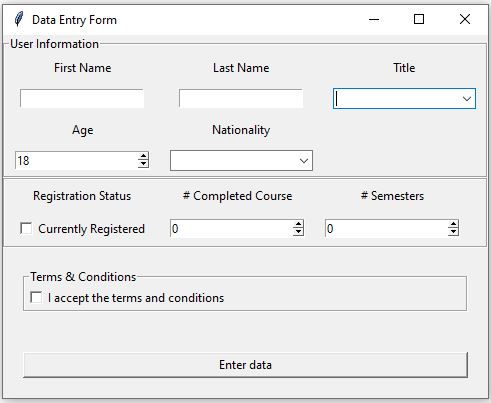

# Project Name
> Python - First Project with Tkinter
## Table of Contents
* [General Info](#general-information)
* [Technologies Used](#technologies-used)
* [Features](#features)
* [Screenshots](#screenshots)
* [Setup](#setup)
* [Usage](#usage)
* [Project Status](#project-status)
* [Room for Improvement](#room-for-improvement)
* [Acknowledgements](#acknowledgements)
* [Contact](#contact)
<!-- * [License](#license) -->
## General Information

A simple Python window application using the Tkinter library.
\
The purpose of the application is to download data from users in a template way when creating an account.

## Technologies Used (min. version of the software)

- Python - version 3.9
## Features
List the ready features here:
- downloading basic data from the user,
- protection against saving data by the user without accepting the terms of use,
- protecting the user against saving incomplete data.

## Screenshots

<!-- If you have screenshots you'd like to share, include them here. -->
## Setup
The program runs on the base:

- Tkinter

## Usage
How does one go about using it?
- pip install -r requirments.txt

- Next run file "Final_Project.py"

## Project Status
Project is:  _beginning of program development. 

## Room for Improvement
- Web aplication.

- Saving data (f.e. to Excel format or Database).

- Adding new needed columns and rows.

- Upgrade the appearance of the application.

## Acknowledgements

- This project was based on youtube canal: " Code First with Hala ".

## Contact
Created by Maciej Cieszynski. 

Feel free to contact me (https://www.linkedin.com/in/maciejcieszynski/)!

<!-- Optional -->